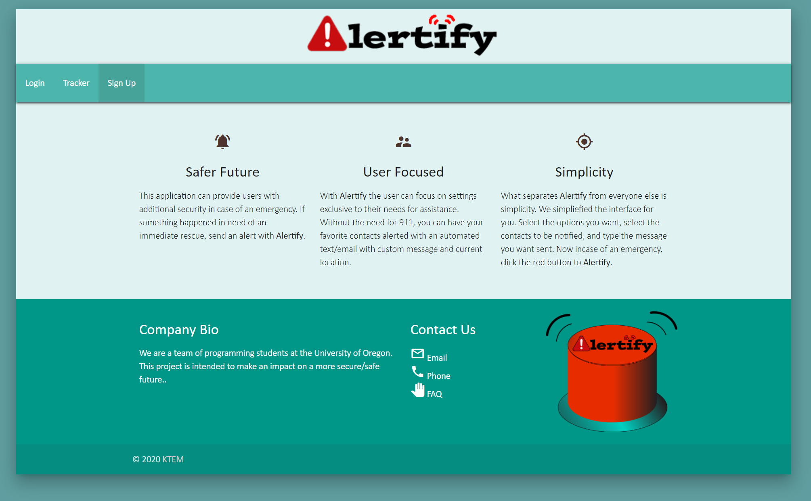

# Alertify

This application can provide users with additional security in case of an emergency. If something happened and in need of an immediate rescue, send an alert with Alertify mobile tracker.

### Technologies Used

* Following languages used:

  * `HTML`

  * `CSS`
  
  * `NodeJS`
  
  * `Sequelize`

  * `Passport`

  * `BCrypt`

### Developers - KTEM

FrontEnd:

  * Mark Kelly
  * Tiana Husted

BackEnd:
  * Echo VanRyn
  * Tiana Husted
  * Mark Kelly
  * Kai Taylor

### UX

User will sign up to create an account. Once created, they can login to provide an emergency contact to be alerted if an emergency situation. Within their login, they have a red button to press (Alertify) that sends out a text to their contact with current location to be found with.

## Example:

## Link to Deployed Application
https://alertifynow.herokuapp.com/
